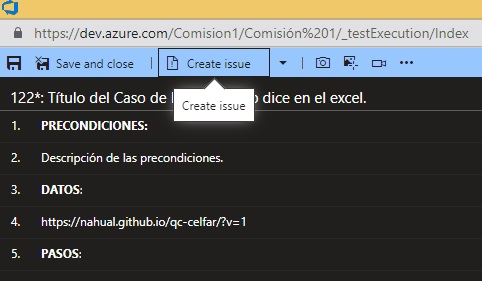

# Organización-Proyecto

El recuadro en verde es una organización.  
El recuadro en violeta es un proyecto.  

Se puede cambiar el tema.  

 

Se puede seleccionar lenguaje.  
En Browser absorve la configuración del explorador.  

Entramos al proyecto

  

Vista principal del proyecto

  

**Overview**: Es la vista general.  
**Boards**: Es el tablero.  
**Repos**: Es el repositorio.  
**Pipelines**:  
**Test Plans**:  
**Artifacts**:  
Nos vamos a centrar en utilizar el Tablero y el Test Plans.  

# Seleccionamos Boards  

  

Y nuevamente **Boards**, que es un tablero de tipo Canvas (Es un sistema visual cuyo objetivo es gestionar el trabajo en la medida en que se va avanzando) 

  
Tiene 3 áreas:  
**To Do**: Tareas para hacer.  
**Doing**: Tareas que se estan haciendo.  
**Done**: Tareas terminadas.  

# Seleccionamos Backlogs

Es una lista de tareas que estan por hacer.

  

# Seleccionamos Workitems

Aquí puedo ver todos los items creados.  
La **Issue** se una tarea mas precisa.  
Dentro de esa **Issue** podemos vincular una **Task**.

  

# Seleccionamos Epic

Le ponemos un título.  
Se la podemos asignar a alguien.  

  

Tenemos un botón de guardar.  
Tenemos una lista para seleccionar el estado.  
Tenemos una caja de Descripción.  

  

Ejemplo de Epica

  

Aparece en el Work items  

  

Si voy a Boards y selecciono Epic, se visualiza la epica creada.  
Genera el ID de forma automática. (116)  

  

Puedo mover la epica de estado.  

  

# Issue  

Una **Issue** es nuestra tarea de Testing.  

# Repos

Los desarrolladores vinculan sus repositorios.

  

# Casos de Prueba - Como crearlos  

Simulamos la creación de tareas de desarrollo para poder crear nuestros casos de prueba.  
Los Issue tienen tag y se puede filtrar para buscar.  
  
En Boards tengo la barra para poder filtrar por tag y otros.  

  

Vinculamos la Issue a nuestra tarea de Testing.

  
  

Escribimos el título de nuestra tarea de Testing.

Queda vinculado y guardamos.

   
   

Para crear los Casos de Prueba vamos a los 3 puntitos.  

Creamos todos los Casos de Pruebas en un solo Issue por una cuestion de practicidad.  
Aqui escribimos todos los casos de prueba que tenemos escritos por ejemplo en excel.  

  

Escribo los Casos de Prueba

  

Abro un Caso de Prueba.

  

Editamos el título y lo ponemos como dice el excel.  
Escribimos los pasos 1 y 2.
Escribimos el Resultado Esperado.  

  

Podemos adjuntar un archivo haciendo click en el botón derecho del mouse.  

  

Si queremos insertar un paso antes del 2, nos posicionamos en el paso 2 y hacemos click en el 1er botón de la barra de herramientas.

  

Eliminamos con la cruz roja.  

  

Ejemplo  

  

Discussion

  

Para ejecutar el caso de Prueba voy a los 3 puntitos y luego Run test 

Se abre en otra pantalla

  

Selecciono los pasos correctos y los incorrectos.  
El comentario que se abre es opcional.  

  

Hacemos click en crear issue

  

Nos trae todos los pasos que pasaron y cuales fallaron.  
Podemos aclarar donde fallo escribiendo ERROR: El título de la página es HTML  

  

Tenemos que ponerle un título.  
Podemos copiar y pegar una imagen con el error.  
Y asi como esta podemos guardar y cerrar.  

Volvemos al caso de prueba y guardamos y cerramos.

Si vamos al tablero, vemos que tenemos la cruz roja porque fallo

Y se nos creo una nueva **Issue**, que es la tarea con el error 

  

Si lo abrimos estan todos los pasos con el error que reportamos y con la captura de pantalla.  

  

Podemos seguir agregando Casos de Prueba a la **Issue** con los 3 puntitos.  

Para el TP FINAL en cada **Issue** podemos escribir nuestros propios casos de prueba.

Aqui entramos  

  

Y vamos creando nuestros propios casos  

  

Aquí escribimos nuestros casos de prueba que vamos sacando de los requerimientos.

  
  

Vamos a cada caso de prueba  

  

Y lo podemos editar

